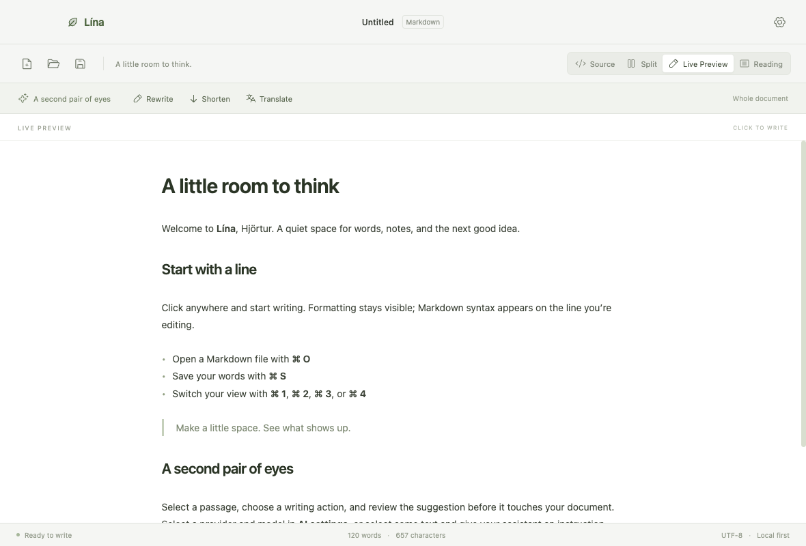
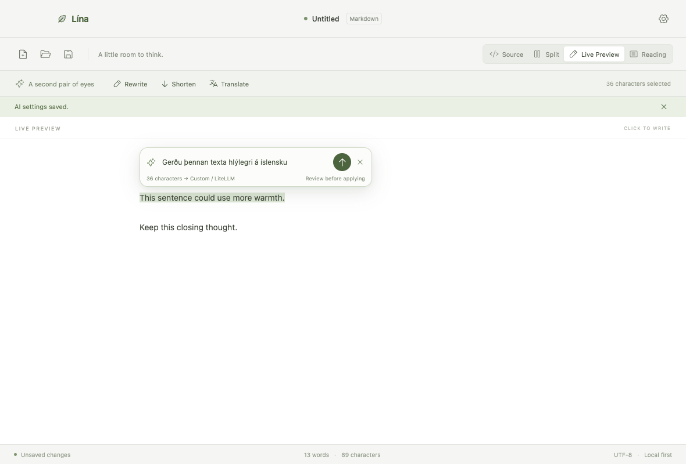

# Lína

[Download for macOS · Apple Silicon](https://github.com/hjortursi/Markdowneditor/releases/latest)



A small, local-first Markdown editor for Hjörtur, built with Electron, TypeScript, React, Vite and CodeMirror. Editable Live Preview, source, split and reading views; native open/save/save-as dialogs; macOS shortcuts; unsaved-change protection; local recovery drafts; and built-in support for multiple AI providers with suggestions you review before applying.

## Run

Open `release/mac-arm64/Lína.app`, or open the DMG in `release` and drag Lína to Applications. The build targets Apple Silicon on macOS. It has a local ad hoc signature for Apple Silicon compatibility and is unnotarized; no signing credentials are used.

From source (Node 22.12+):

```sh
npm ci --legacy-peer-deps
npm start
```

`npm start` builds the TypeScript and renderer before launching Electron. This project is independent of other repositories.

## Write in Live Preview

Live Preview is the default view. Click a line and type directly in the formatted document, as in Obsidian. Markdown syntax appears on the line you are editing; headings, emphasis, lists, quotes and code remain styled elsewhere. Click a task checkbox to update its `[ ]` / `[x]` marker. The underlying Markdown is preserved, and switching views keeps the selection and undo history.

Use Source for plain Markdown, Split for source beside the rendered result, or Reading for a read-only view. Tables stay as editable Markdown in Live Preview. Images remain inert placeholders in every view.

## Keyboard shortcuts

| Action | Shortcut |
| --- | --- |
| New | ⌘ N |
| Open | ⌘ O |
| Save | ⌘ S |
| Save as | ⇧ ⌘ S |
| Close | ⌘ W |
| Quit | ⌘ Q |
| Source / split / Live Preview / reading | ⌘ 1 / ⌘ 2 / ⌘ 3 / ⌘ 4 |
| AI settings | ⌘ , |
| Undo / redo | ⌘ Z / ⇧ ⌘ Z |

## Optional AI · built into the app

No LiteLLM server, Python installation or local proxy is required for cloud providers. Open **AI settings**, choose a provider, enter the model ID available to your account, and add your own API key:

| Provider | Connection |
| --- | --- |
| OpenAI | Direct Chat Completions API |
| Anthropic · Claude | Direct Messages API |
| Google · Gemini | Direct generateContent API |
| OpenRouter | Many providers with one key; use its `provider/model` IDs |
| Ollama · local | An existing Ollama server and an installed model |
| Custom / LiteLLM | Any OpenAI-compatible endpoint, including LiteLLM, Groq, Mistral or LM Studio |

Model IDs are editable, so the app is not tied to a hardcoded model catalogue. Ollama and Custom expose a base URL; cloud presets use the provider’s official HTTPS endpoint. LiteLLM is supported as an optional gateway rather than bundled into the app. The built-in TypeScript adapters provide the common interface for the providers above.

Each provider keeps its own model and credential profile. Keys are session-only by default. **Remember key securely on this Mac** stores an encrypted key using Electron safeStorage and macOS-backed encryption. Stored keys and ciphertext never return to the renderer. Changing a custom endpoint clears its old credential. Saving settings makes no connection test or AI request, and there is no automatic credential lookup.

### Edit a selected passage

Select text in Source, Split or Live Preview. A small prompt pill appears beside the selection, above it when space permits. Type an instruction such as “Make this friendlier in Icelandic” and press Enter or the arrow. Only the selected passage and your instruction are sent. Review the original and proposed text, then accept or reject. Accepting changes only that passage and forms a separate undo step. The prompt stays intact if you need to configure AI first; completing setup does not submit it automatically. Escape dismisses the pill.



The Rewrite, Shorten and Translate buttons also work on selected text, or on the whole document when nothing is selected. Their confirmation sheet shows the destination and scope. Edits made during a request invalidate its response. Cancel and a 60-second timeout abort pending requests. Truncated responses are rejected instead of being offered as a complete replacement.

No real or paid AI endpoint was called during development. Provider formats and credential profiles are tested with mocks; Electron tests use a local mock server. Real account authentication and model availability remain to be verified with your own configuration. Protocol references: [OpenAI](https://developers.openai.com/api/reference/resources/chat), [Claude](https://platform.claude.com/docs/en/api/overview), [Gemini](https://ai.google.dev/api/generate-content), [OpenRouter](https://openrouter.ai/docs/api_reference/overview), and optional [LiteLLM](https://docs.litellm.ai/docs/).

## Files and privacy

File operations and AI transport live in the main process. The renderer is sandboxed with context isolation, no Node integration, a narrow preload API and a restrictive content security policy. No navigation, popup windows or permission requests are allowed. Markdown raw HTML is disabled, preview output is sanitized, links are rendered as text, and images are placeholders. Preview does not fetch remote resources or load arbitrary local images.

Documents are UTF-8, with a 4 MB limit. CRLF files use normalized editor offsets and retain CRLF when saved. AI requests are limited to 80,000 characters and responses to 1 MB. Writes use a temporary sibling file and rename, preserve ordinary file permissions and follow a selected symlink to its target. Existing files changed externally require explicit replacement. No multi-window or concurrent filesystem editing support is provided.

Unsaved drafts are stored locally, after a 400 ms debounce, at `~/Library/Application Support/Lína/recovery.json`. They are restored on the next launch. This recovery file contains document text and is not encrypted. Successful save or explicit discard removes it. A sudden force quit can lose the last debounce interval. Preferences are in the same directory. Normal close/quit/new/open actions protect unsaved edits, and canceled saves leave them intact.

## Verify and package

```sh
npm run typecheck
npm test
npm run test:e2e
npm run package
```

Unit tests cover local file flows, cancel and failure behavior, external changes, recovery, stale document versions, preview sanitization, mocked native provider adapters, credential isolation/migration and AI selection boundaries. Playwright tests launch the actual Electron app with isolated temporary application data and mocked native dialog choices. They exercise editing and task toggles in Live Preview, exact Markdown saves, undo/redo across views, file shortcuts, save-as, cancel protection, selection prompts, setup without uploads, exact passage replacement, provider settings, AI accept/reject/undo, stale responses and blocked preview network access. Screenshots are written to `test-results`. `node scripts/smoke-package.cjs` checks the packaged app with isolated temporary application data.

`npm run package` builds a local Apple Silicon `.app` and DMG. It does not publish, deploy or notarize, and uses no user signing identity. A local ad hoc signature is applied for macOS compatibility. Real provider authentication, encrypted key persistence through macOS Keychain, Gatekeeper behavior on other Macs, Intel builds and notarization are not tested. Runtime dependencies were checked with `npm audit --omit=dev` (zero reported vulnerabilities at build time).

The packaging hook retains Electron’s original helper bundle names to work around the macOS 26 launch issue documented in [electron-builder #9771](https://github.com/electron-userland/electron-builder/issues/9771). Helpers are renamed before the local ad hoc signature is applied.
